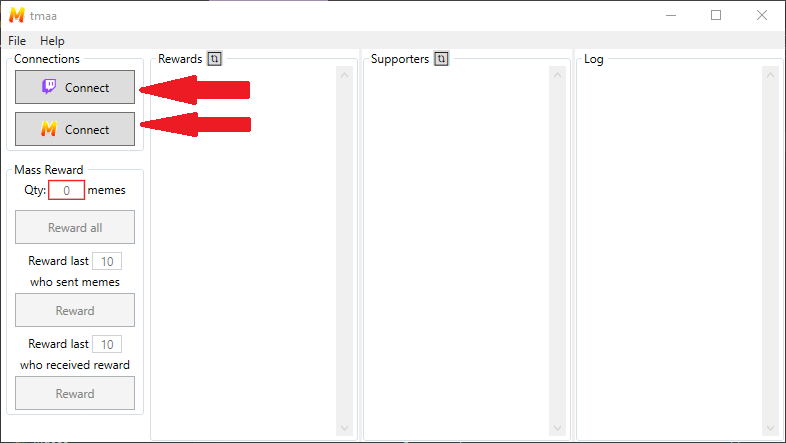
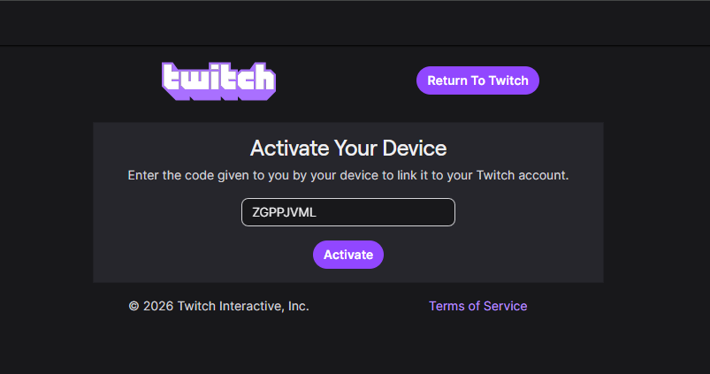
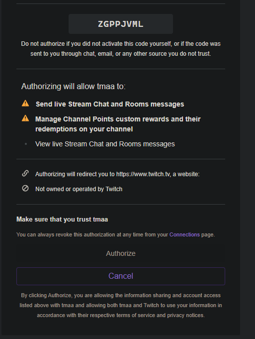
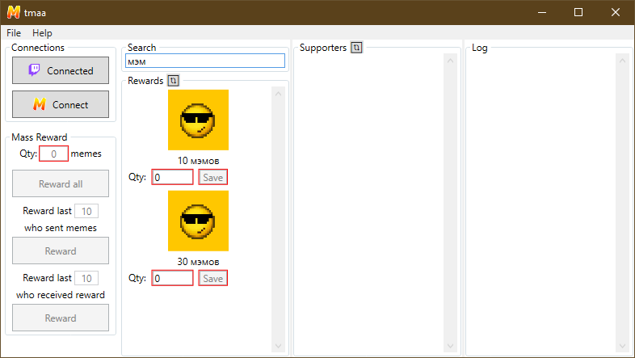
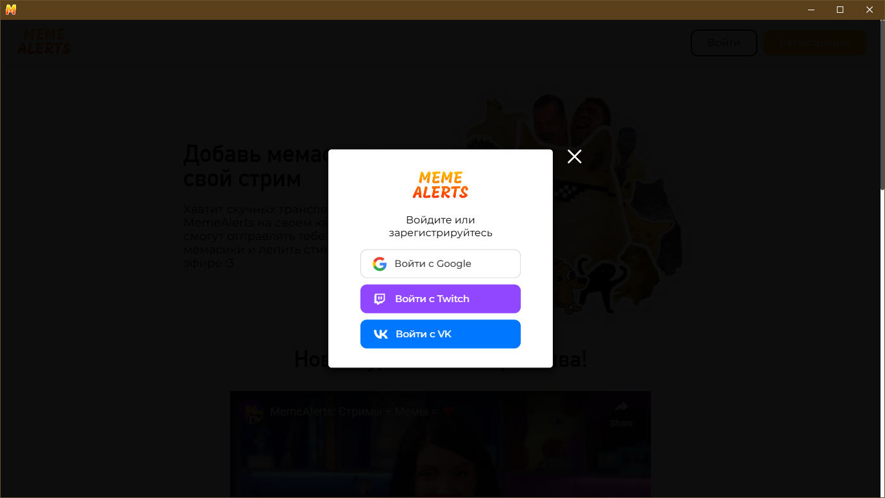
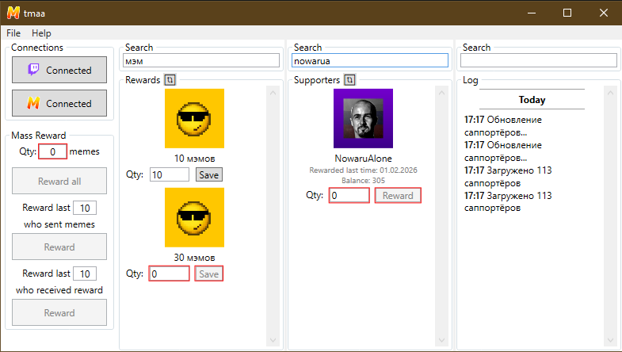
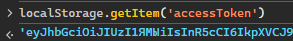
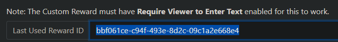

# TwitchMemeAlertsAuto

Утилита по автоматической выдаче мемкойнов за награды Twitch

## Как использовать

Есть 2 версии программы, обычная (**GUI**) программа с дополнительными функциями и упрощённая версия для командной строки (**CLI**)

| Функция                                                                              | GUI | CLI |
| ------------------------------------------------------------------------------------ | :-: | :-: |
| Автоматическая выдача мемкойнов                                                      | ✅  | ✅  |
| Выдача мемов по нику Twitch                                                          | ✅  | ✅  |
| Простой способ интеграции с Twitch и MemeAlerts                                      | ✅  | ❌  |
| Удобная настройка наград и соответствия с кол-вом автоматически выдаваемых мемкойнов | ✅  | ❌  |
| Список саппортёров MemeAlerts с возможностью награды прямо из программы              | ✅  | ❌  |
| Массовое награждение саппортёров                                                     | ✅  | ❌  |
| Удобный лог событий                                                                  | ✅  | ❌  |
| Возможность свернуть в системный трей                                                | ✅  | ❌  |
| Автообновление                                                                       | ✅  | ❌  |
| Автозапуск при входе в систему                                                       | ✅  | ❌  |

### Обе версии качать из [последнего релиза](https://github.com/NowaLone/TwitchMemeAlertsAuto/releases/latest)

### GUI

- Создаём награду на твиче для выдачи мемкойнов
- Качаем **tmaa-wpf.zip**
- Разархивируем куда угодно
- Внутри папки запускаем **tmaa.exe**
- Подключаем нужные интеграции, настраиваем
- [Подробная настройка](#подробная-настройка-gui)

### CLI

- Создаём награду на твиче для выдачи мемкойнов
- Качаем **tmaa.exe**
- Через терминал запускаем **tmaa.exe --help**
- Читаем описание параметров и запускаем уже с ними
- [Подробная настройка](#подробная-настройка-cli)

### 🚨 НАГРАДА ДОЛЖНА ИМЕТЬ ПОЛЕ ДЛЯ ВВОДА 🚨

### 🚨 ПОЛЬЗОВАТЕЛЬ ДОЛЖЕН БЫТЬ САППОРТЁРОМ НА MEMEALERTS (КУПИТЬ МЕМКОЙН ИЛИ ПОЛУЧИТЬ ПРИВЕТСТВЕННЫЙ БОНУС)🚨

## Подробная настройка GUI

Если вам необходим полный функционал, нужно подключить и Twitch и MemeAlerts. Если вы
хотите пользоваться пользоваться автоматическим начислением, то достаточно подключить только MemeAlerts

Подключаем нужные интеграции


### Подключение Twitch

В вашем браузере откроется страница для активации устройства



жмёте активировать, откроется страница запроса прав (права, собственно, для чтения наград и чата)



Даёте права, в программе автоматически загрузятся награды



В поле под нужными наградами вписываете сколько выдавать мемкойнов за награду, нажимаете сохранить

### Подключение MemeAlerts

Откроется встроенный браузер со страницей MemeAlerts где вам надо авторизоваться <sub>почему так?[^1]</sub>

[^1]: так как у MemeAlerts нету публичного api для авторизации (и вообще никакого), приходится проделывать трюк аналогичный тому как описано в [Как достать токен MemeAlerts?](#как-достать-токен-memealerts), во внешнем браузере этого сделать не получится



Авторизуетесь, в программе автоматически загрузятся саппортёры



### Небольшой FAQ

В поле под саппортёром можно ввести и выдать нужное кол-во мемкойнов (аналогично сайту)

Слева есть кнопки массового награждения, в первое поле вводится сколько мемкойнов выдать,
далее есть выбор по какому шаблону наградить:

- Наградить всех саппортёров
- Наградить последних N саппортёров отправивших мемы
- Наградить последних N саппортёров кто получал мемкойны

Автоматически обновления не проверяются, но при наличии обновлений, обновиться можно автоматически, для этого нажмите Помощь -> Проверить обновления

Двойной клик по иконке в трее сворачивает/разворачивает программу

## Подробная настройка CLI

### Как достать токен MemeAlerts?

- Переходим на https://memealerts.com/
- Авторизуемся
- Открываем консоль разработчика (зависит от браузера, обычно F12 или Ctrl+Shift+I)
  
- пишем в консоль
  ```js
  localStorage.getItem("accessToken");
  ```
- Получаем токен и запоминаем его
  

### Как достать Id награды Twitch?

- Переходим на https://www.instafluff.tv/TwitchCustomRewardID/?channel=ВАШ_КАНАЛ
- Прожимаем нужную награду на канале
- На сайте должен появиться Id награды, запоминаем
  

Итоговый вариант запуска будет выглядеть как то так:

```cmd
tmaa.exe "-c=justinfan123" "-t="0Q1w2E3r4T5y6" "-r=529b746d-ccd2-45fd-970b-f364e84b45a4:10,185bf54c-01a1-4806-a795-c84becd2e600:30"
```

### Как создать удобный батник?

создаёте .bat файл со следующим содержанием и подставив нужные параметры

```cmd
start "tmaa" /D c:\ПАПКА\ГДЕ\ЛЕЖИТ\УТИЛИТА tmaa.exe "-c=justinfan123" "-t="0Q1w2E3r4T5y6" "-r=529b746d-ccd2-45fd-970b-f364e84b45a4:10,185bf54c-01a1-4806-a795-c84becd2e600:30"
```

ну а на батник уже можно повесить иконки и сделать ярлык и будет всё удобно и красиво
